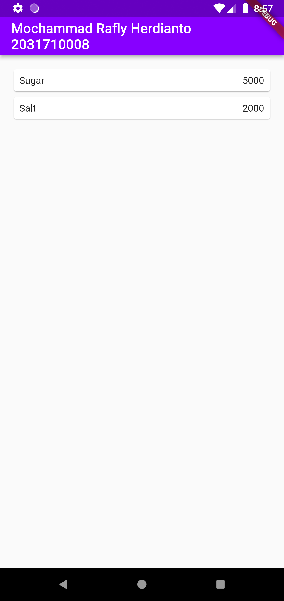
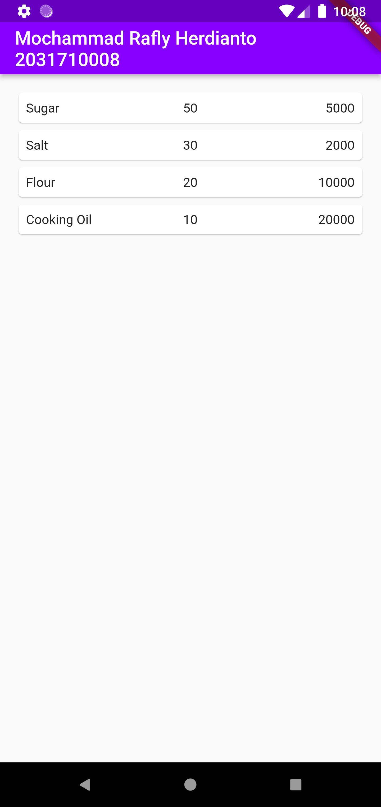

# Tugas 5 Pemrograman Mobile

Membuat Aplikasi Flutter Navigasi dan Route

Nama  : Mochammad Rafly Herdianto  
NIM   : 2031710008  
Kelas : MI-2C  
Prodi : D3 MI  

## Hasil Praktikum

### Praktikum 1

### Tugas
Halaman 1

 
Halaman 2

 